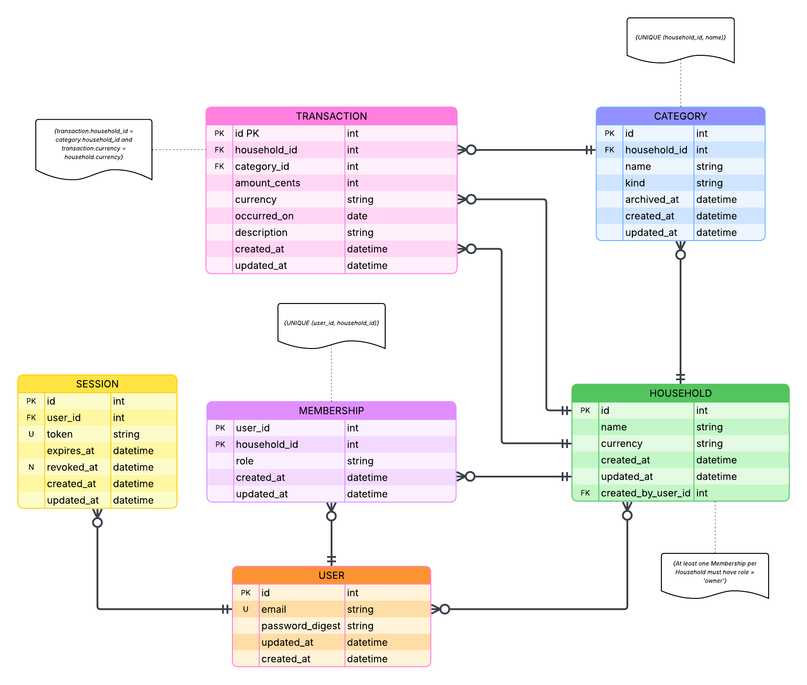

# SimpleSave API

**SimpleSave** is a self-hostable, privacy-first budgeting API designed for individuals, couples, and households who want full control over their financial data.

The project prioritizes:
- clarity over cleverness
- explicit domain modeling
- incremental complexity
- learnability (Ruby/Rails internals, authentication, domain-driven design)

This repository contains the **backend API** powering SimpleSave.

---

## ✨ Goals

- 🏠 Household-first budgeting (solo users included)
- 🔐 Lightweight, explicit authentication
- 🧩 Clear domain boundaries (users vs data ownership)
- 📊 Flexible foundation for budgeting, reporting, and imports
- 🧪 Strong test coverage and predictable behavior
- 🧠 Built as a learning project first, product second

---

## 🧠 Core Concepts

### Households
A **Household** represents a financial space.
Every user belongs to at least one household, even when budgeting alone.

Households own:
- categories
- transactions
- budgets (future)

This avoids special cases and makes future sharing trivial.

---

### Users & Memberships
- Users represent authenticated identities.
- Memberships define which users belong to which households.
- Ownership and permissions are expressed through memberships, not hardcoded roles.

---

### Categories & Transactions
- Categories are scoped to households and archived (never deleted).
- Transactions belong to exactly one household and one category.
- Financial integrity is enforced through explicit constraints.

---

## 🗺 Entity Relationship Model (ERM)

The following diagram represents the **domain model** for SimpleSave.

It defines ownership boundaries, authentication primitives, and financial invariants.

### Key invariants
- All financial data is owned by households
- Categories are unique per household
- Transactions must reference categories within the same household
- Categories are archived instead of deleted
- Each household must always have at least one owner

---

## 🔐 Authentication

Authentication is implemented using:
- `has_secure_password` on users
- token-based sessions for API access

This keeps the system:
- stateless
- explicit
- easy to reason about
- easy to migrate later to solutions like Devise or JWT if desired

---

## 🧪 Testing

The API uses **Minitest** with enhanced reporting to ensure:
- clear test output
- fast feedback loops
- confidence in domain behavior

Tests are written to validate behavior, not implementation details.

---

## 🚧 Project Status

This project is under **active development**.

Current focus:
- authentication foundation
- household and membership models
- category and transaction CRUD
- manual transaction imports (v1)

Future iterations will expand into:
- budgeting rules
- reporting and summaries
- import/export flows
- optional bank integrations

---

## 📜 License

This project is licensed under the **MIT License**.

You are free to use, modify, and self-host SimpleSave for personal or commercial use.

---

## 🤝 Philosophy

SimpleSave is intentionally opinionated:
- correctness over shortcuts
- explicit over implicit
- boring data models that scale

If something feels simple, it’s because complexity was pushed *out of the core* — on purpose.